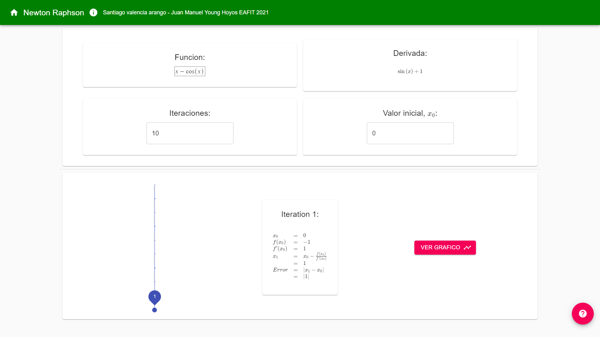

# ST0256-Numerical-Analysis


The idea of this project is to test out if it is worth it to use `C++` instead of `Python` for
algorithms of some numeric methods, like finding roots of non-linear equations using
Newton-Raphson's method.

Here is the link from the other part of the complete project:

| [Root equations web](https://github.com/svalenciaaq/RaicesDeEcuacionesWeb) |
| ------------- |
|  |

### Check it out deployed right here: http://3.226.113.5:3001/#/
## Introduction

Why this project? the aim of this project is to be able to analyze and draw a conclusion to the 
question, is it worth spending more time programming in C ++? Or is it more profitable to do this 
type of algorithms using Python and its libraries in terms of development time and program performance?

## What will we test?

In this project we will only find roots of an equation using:

- Newton-Raphson method.
- Bisection method.
- Secant method.
- Regula-Falsi method.
- Fixed-point iteration method.

### Device used


### C++ Compiler

```
g++ (Ubuntu 9.3.0-17ubuntu1~20.04) 9.3.0
```

### Python interpreter

```
Python 3.8.5
```

## How to test the Python methods

Make sure to have installed `numpy`, `sympy` and `pytest`.

```
pip install numpy
pip install sympy
pip install pytest
```

Then go the `Python/` folder and then run the test of the algorithm you want, for instance:

```
cd Python
pytest bisection.py
pytest fixedPoint.py
pytest newtonRaphson.py
pytest regulaFalsi.py
pytest secant.py
```