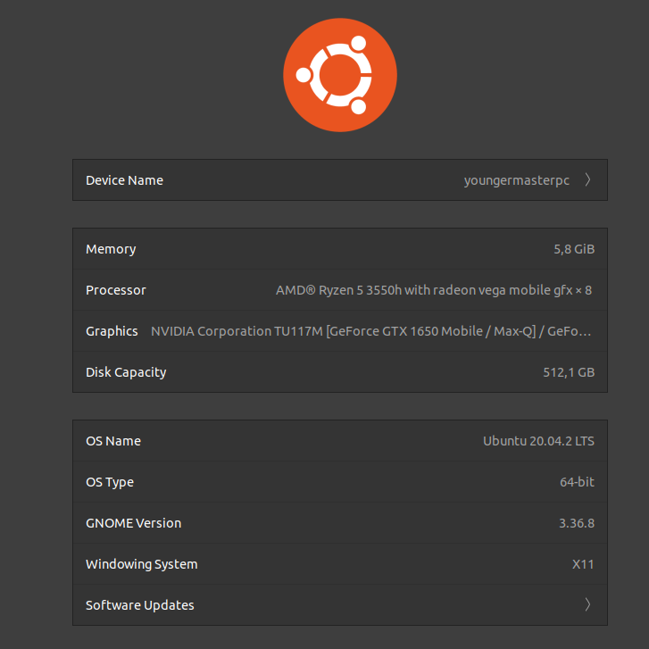

# ST0256-Numerical-Analysis

The idea of this project is to test out if it is worth it to use `C++` instead of `Python` for
algorithms of some numeric methods, like finding roots of non-linear equations using
Newton-Raphson's method.

## Introduction

Why this project? the aim of this project is to be able to analyze and draw a conclusion to the 
question, is it worth spending more time programming in C ++? Or is it more profitable to do this 
type of algorithms using Python and its libraries in terms of development time and program performance?

## What will we test?

In this project we will only find roots of an equation using:

- Newton-Raphson method.
- Bisection method.
- Secant method.
- Regula-Falsi method.
- Fixed-point iteration method.

### Device used



### C++ Compiler

```
g++ (Ubuntu 9.3.0-17ubuntu1~20.04) 9.3.0
```

### Python interpreter

```
Python 3.8.5
```


## Newton-Raphson comparison

### variables
```
Equation: X³+X²+3 

Initial point: -20 

Tolerance: 0.00001 

Maximum number of iterations: 20
```

### C++ time


### Python time


## Bisection comparison

### variables


### C++ time


### Python time


## Secant comparison

### variables


### C++ time


### Python time


## Regula-Falsi comparison

### variables


### C++ time


### Python time


## Fixed-point iteration comparison

### variables


### C++ time


### Python time


## Conclusion

## References